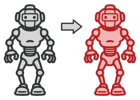

# The most often-used OOP design patterns

### Generating patterns
<table>
  <tr>
    <td> 
        <a href="src/generating/factory_method">
            
            
Factory method

        </a>
    </td>
    <td> 
        <a href="src/generating/abstract_factory">
            
            
Abstract factory

        </a>
    </td>
    <td> 
        <a href="src/generating/builder">
            
            
Builder

        </a>
    </td>
    <td> 
        <a href="src/generating/prototype">
            
            
Prototype

        </a>
    </td>
    <td> 
        <a href="src/generating/singleton">
            
            
Singleton

        </a>
    </td>
  </tr> 
</table>

### Structural patterns
<table>
  <tr>
    <td> 
        <a href="src/structural/adapter">
            
            
Adapter

        </a>
    </td>
    <td> 
        <a href="src/structural/bridge">
            
            
Bridge

        </a>
    </td>
    <td> 
        <a href="src/structural/composite">
            
            
Composite

        </a>
    </td>
    <td> 
        <a href="src/structural/decorator">
            
            
Decorator

        </a>
    </td>
    <td> 
        <a href="src/structural/facade">
            
            
Facade

        </a>
    </td>
    <td> 
        <a href="src/structural/flyweight">
            
            
Flyweight

        </a>
    </td>
    <td> 
        <a href="src/structural/proxy">
            
            
Proxy

        </a>
    </td>
  </tr> 
</table>
