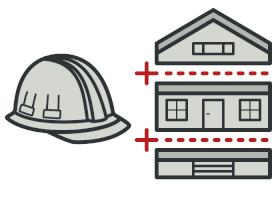

#The most often-used OOP design patterns

### Generating patterns
<table>
  <tr>
    <td> 
        <a href="src/generating/factory_method">
            
            
Factory method

        </a>
    </td>
    <td> 
        <a href="src/generating/abstract_factory">
            
            
Abstract factory

        </a>
    </td>
  </tr> 
  <tr>
    <td> 
        <a href="src/generating/builder">
            
            
Builder

        </a>
    </td>
    <td> 
        <a href="src/generating/prototype">
            
            
Prototype

        </a>
    </td>
  </tr>
  <tr>
    <td> 
        <a href="src/generating/singleton">
            
            
Singleton

        </a>
    </td>
  </tr>
</table>